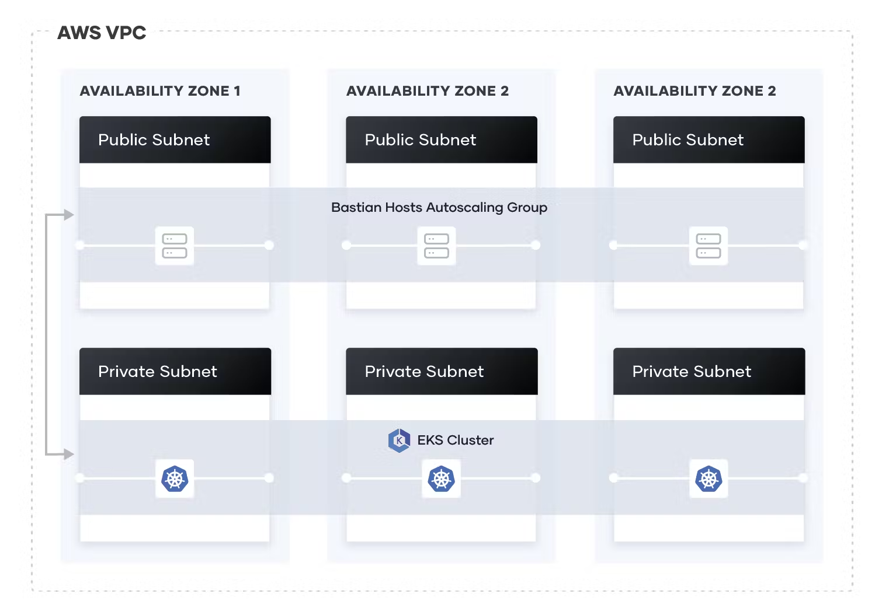

## setup_aws_eks

> **_NOTE:_**  PREVIEW: This module will be used in the future when testing against real EKS Cluster 

This module sets up the EKS cluster and its relevant resources for the integration tests, in us-west-2. It's meant to be only setup once for integration tests to use when installing and deleting helm charts. 

The modules uses the elevated IAM role `arn:aws:iam::767397788203:role/OrganizationAccountAccessRole` to perform the following actions. 

The configuration defines a new VPC in which to provision the cluster, and uses the public EKS module to create the required resources, including Auto Scaling Groups, security groups, and IAM Roles and Policies.

The architecture of this configuration is: 

The code is borrowed from Terraform's example and customized (https://github.com/hashicorp/learn-terraform-provision-eks-cluster/blob/main/main.tf)

The above components will referenced as data sources by the `deploy_helm` module for use in terraform tests 

## State 

The state of the this module is stored in the S3 bucket `helm-charts-agent-terraform-state` that was created by the `setup_aws_backend` module. It uses an S3 backend. 
The role assumption needed for both the S3 backend and AWS provider is the same: `arn:aws:iam::767397788203:role/OrganizationAccountAccessRole`. The bucket can be found in us-west-1
